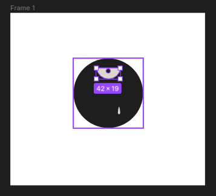
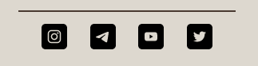

En este documento se describirán los pasos que se llevaron a cabo en la elaboración de esta PEC. Se han descrito estos de forma concisa y objetiva, intentando respetar el orden cronológico en el que sucedieron las distintas tomas de decisión y posteriores ejecuciones de las mismas, aunque dando siempre prioridad al orden temático. 

Al igual que en la PEC 1 de esta asignatura, la página final es accessible de forma pública a través del siguiente enlace:

[https://lively-fenglisu-dd4606.netlify.app/](https://lively-fenglisu-dd4606.netlify.app/)

El repositorio de GitHub es el siguiente. Al haberse trabajado sobre la PEC1, implementando lo exigido en el enunciado de la práctica, comparte el mismo nombre que recibía en la práctica anterior, «PEC1-Herramientas»:

[https://github.com/nacaru-w/PEC1-Herramientas](https://github.com/nacaru-w/PEC1-Herramientas)

El proyecto se realizó en un ordenador con un SO Linux Ubuntu 22.04.1 LTS. Para la redacción de la parte teórica se creó un documento en formato [markdown](https://www.markdownguide.org/) que sería posteriormente transformado en un documento PDF a través de LaTeX con la herramienta de conversión libre [Pandoc](https://pandoc.org/).

## Logotipo de la web

Uno de los requisitos descritos en el enunciado de la práctica era la elaboración de un logotipo para la web. Con el objetivo de cumplirlo, se procedió a elaborar una imagen a través del programa de la aplicación de edición de gráficos vectoriales de uso abierto [Figma](https://www.figma.com).

{ width=250px }

Se realizó un proyecto con el objetivo de diseñar un logotipo minimalista que representase de la web y el personaje que esta describe. Se decidió utilizar como base una forma circular, a menudo asociada con la glotonería, sobre la cual se añadió un ojo semiabierto representado a través de un semicírculo, relacionado con elementos mitológicos o fantásticos como trolls o cíclopes, así como una imagen elíptica, colocada en la parte inferior y representando una gota de saliva, haciendo referencia al hambre. En prototipos iniciales se estudió la posibilidad de añadir dientes u otros rasgos de la cara o cuerpo de Tarrare, pero se descartaron para este diseño por no corresponder adecuadamente con la estética minimalista de la página.

Para la exportación de esta imagen, se decidió utilizar un formato SVG, al estar compuesta de formas geométricas simples, ser este un formato ligero, y permitir la modificación del tamaño sin pérdida alguna de calidad.

Una vez exportada, se añadió a la sección `header` de todos los archivos `html` de la web la página web a través del siguiente código:

```html
<figure>
    
</figure>
```

Se completó a través de la implementación del código CSS siguiente. Este comprende la presencia de una transformación a través de la propiedad `transform`, que realiza un aumento del tamaño del logo al pasar el ratón por encima (`hover`), simbolizando la glotonería de Tarrare:

```css
header figure {
    width: clamp(4em, 8%, 10em);
    margin: 0 auto;
    transition: width 1s ease-in-out;
}

header img {
    margin: 0 auto;
    display: block;
    width: 100%;
}

header figure:hover {
    width: clamp(4.5em, 9%, 11em);
}
```

Se hizo uso de la función CSS `clamp()` para ajustar el tamaño de forma dinámica y dotarle de responsividad, evitando que el logo posea un tamaño demasiado reducido en dispositivos de pantalla pequeño, y limitando el tamaño en dispositivos significativamente anchos.

## Uso de `clip-path` en la página principal

Como parte de los objetivos de la práctica, se solicitaba el uso de la propiedad CSS `clip-path` en alguno de los elementos de la página principal. Mediante el uso de la aplicación [clippy](https://bennettfeely.com/clippy/), se probaron diversas formas que podrían ajustarse a la estética y coherencia del proyecto. Después de reflexionar, se decidió utilizar `clip-path` con el valor `inset` para redondear los bordes de la imagen principal que aparece en el centro de esta página, a través de la adición del siguiente código CSS:

```css
main figure img.main {
    clip-path: inset(0 0 0 0 round 5% 5% 5% 5%);
}
```

Adicionalmente, se ha añadido una pequeña versión del logo principal que aparece al hacer desplegarse el menú lateral (_sidebar_). Esta versión se ha conseguido a través de la utilización, de nuevo, de la propiedad `clip-path`, contenida en la siguiente regla y con el valor descrito a continuación:

```css
.sidebar figure.index_logo {
    width: 30%;
    margin: 1em auto 0 auto;
    clip-path: circle(26.5% at 50% 28%);
}
```

A través del valor `circle(26.5% at 50% 28%)`, se consigue que la imagen se centre en la parte del ojo del logo, simbolizando «búsqueda», hecho por el que se ha colocado en la parte superior del este índice.

[Social Media Icons 2021 por SHOCKStudio.pl](https://www.figma.com/community/file/929729132405358534). Licencia CC-BY 4.0.

## Uso de `clip-path` de forma global

Con el objetivo de mejorar la exposición estética de las imágenes de la página. Se ha utilizado la propiedad `clip-path` para redondear los bordes, de forma más suave respecto a lo realizado en la página principal, en todas las imágenes que se encuentran en el espacio `main` de la web. El código CSS que se ha utilizado para lograr este objetivo es el siguiente:[^1]

```css
main figure img.gluttony {
    clip-path: inset(0 0 0 0 round 3% 3% 3% 3%);
}
```

## Adición de elementos gráficos en el _footer_

Dentro de los nuevos requisitos de la PAC se encontraba el de habilitar un footer que poseyese enlaces a todas las páginas. Esto se ha hecho mediante la adición de dos secciones `section`, una en la que se contienen dos `ul` con todos los enlaces de la web divididos en dos columnas, y otra en la que se han contenido enlaces a redes sociales.

Se ha hecho uso de la propiedad CSS `display` para que estos aparezcan repartidos en dos columnas, y de la propiedad `display-content` para que queden centrados. Gracias a la primera, las listas actuarán de forma _responsive_, de tal forma que al reducir considerablemente la anchura del dispositivo, estas se mostrarán una encima de la otra.

Además, la práctica solicitaba, igualmente, que el _footer_ debía de contener un elemento gráfico. Para cumplir este requisito se habilitó una lista en la que se incluyen enlaces (muertos, en este caso) a redes sociales. Esta está compuesta de un elemento `ul` que contiene elementos `img`. Para estos iconos, se han utilizado imágenes de gráficos vectoriales (`svg`), por ser este formato muy ligero y constituir formas geométricas simples en el patrón de los iconos.

```css
footer section div.media_container {
    border-top: solid #493A31 2px;
}

footer section ul.media {
    display: flex;
    padding-bottom: 3em;
}

footer section ul.media li {
    margin: 0 1em;
    transition: opacity 0.25s ease-in-out;
}

footer section ul.media li:hover {
    opacity: 0.5;
}
```

Además, como puede comprobarse en las dos últimas reglas CSS del código anterior, se ha añadido un mecanismo de transición al pasar el ratón por encima, de forma que los iconos pierden parcialmente la opacidad con el objetivo de destacar su función de enlace.



## Optimización de imágenes

Para este objetivo se instaló el paquete [sharp](https://www.npmjs.com/package/sharp). 

Además, se modificó el archivo JSON para que este incluyese a sharp como parte de las dependencias necesarias para su ejecución:

```json
  "dependencies": {
    "sharp": "^0.31.3",
    "sidebarjs": "^9.0.0"
  }
```

Se creó, además, un archivo `sharp.config.json` en el `root` del proyecto para optimizar todas las imágenes de la página.

```json
{
    "quality": 85
}
```

## Adaptación _responsive_ de las imágenes

Una de las exigencias del enunciado de la PEC era la de dotar a las imágenes de capacidad _responsive_, es decir, que estas puedan adaptarse al dispositivo a través del cual se visualizan.

Para cumplir este objetivo, se hizo uso de etiquetas `picture`, dentro de las cuales se colocaron elementos `source` que, a través de `media` _queries_, permiten adaptar adecuadamente la imagen al dispositivo.

Dependiendo de la imagen, se prefirió utilizar un enfoque basado en la dirección de arte o uno en el que se utiliza el _resolution switching_ (de tamaño o de resolución) para este objetivo.

Un ejemplo de adaptación basada en el tamaño se da en la página principal (`index.html`). Aquí, se ha utilizado una imagen de menor tamaño que será empleada en pantallas en las que la propiedad `width` del dispositivo es menor a 799 píxeles:

```html
<picture>
    <source media="(max-width: 799px)" srcset='img/Mémoire_sur_la_polyphagie_498px.jpg'>
    <source media="(min-width: 800px)" srcset='img/Mémoire_sur_la_polyphagie_640px.jpg'>
    
</picture>
```

En el caso de la página de detalle 3, se ha utilizado un enfoque basado en la dirección de arte. En este caso, al tratarse de una imagen de un dibujo renacentista con una cantidad significativa de detalles, se ha tomado una versión recortada —en la que se muestran sólo los detalles más significativos—, que aparecerá cuando se visualize la página a través de dispositivos de menor tamaño:

```html
    <picture>
        <source media="(max-width: 799px)" srcset='img/the_elder_cropped.jpg'>
        <source media="(min-width: 800px)" srcset='img/the_elder.jpg'>
        
    </picture>
```


Además de esto, se ha hecho empleo de `@media` _queries_, al comienzo del documento CSS, que adaptan el tamaño de la anchura `width` del contenedor de las imágenes del espacio `main` de forma que estas puedan abarcar un mayor espacio, tomándolo del margen, en situaciones en las que el espacio del _viewport_ es menor. Cito aquí un ejemplo de las _queries_ utilizadas:

```css
@media only screen and (min-width: 0em) {
    main {
        margin-left: 10%;
        margin-right: 10%;
    }

    main .gluttony {
        max-width: 90%;
        max-height: 90%;
    }

    nav ul {
        font-size: 1.1em;
    }
}

@media only screen and (min-width: 500px) {
    main .gluttony {
        max-width: 60%;
        max-height: 60%;
    }
}
```

Para la transformación, cambio de resolución, adaptación y maquetado de las imágenes se usaron las aplicaciones [imagemagick](https://imagemagick.org/index.php), Figma, [Trimage](https://trimage.org/) y [sharp](https://www.npmjs.com/package/sharp).

## Inclusión y animación de imagen SVG en la página de presentación

También como parte de los requisitos de la práctica, se implementó una imagen en formato SVG en la página `presentation.html` del proyecto. Esto se hizo mediante la adición de código HTML que definía de forma manual una imagen SVG de la siguiente forma:

```html
        <div class="container">
            <svg xmlns="http://www.w3.org/2000/svg" viewBox="0 0 22 22">
                <defs id="defs3051">
                    <style type="text/css" id="current-color-scheme">
                        .ColorScheme-Text {
                            color: #4d4d4d;
                        }
                    </style>
                </defs>
                <path style="fill:currentColor;fill-opacity:1;stroke:none"
                    d="M 11 3 C 6.568 3 3 6.568 3 11 C 3 15.432 6.568 19 11 19 C 15.432 19 19 15.432 19 11 C 19 6.568 15.432 3 11 3 z M 11 4 C 14.878 4 18 7.122 18 11 C 18 14.878 14.878 18 11 18 C 7.122 18 4 14.878 4 11 C 4 7.122 7.122 4 11 4 z M 10 6 L 10 8 L 12 8 L 12 6 L 10 6 z M 10 9 L 10 16 L 12 16 L 12 9 L 10 9 z "
                    class="ColorScheme-Text" />
            </svg>
        </div>
```

Esta se incluyó en un element `div` con la clase `container` de forma que se pudiera manipular el código CSS más fácilmente.

Se decidió, entonces, incluir una animación simple, al ser esto también parte de los requisitos de la PEC. En este caso, se definieron los `@keyframes` mediante el siguiente código:

```css
@keyframes pulse {
    0% {
        transform: scale(1);
    }

    40% {
        transform: scale(1.1) rotate(5deg);
    }

    80% {
        transform: scale(1.1) rotate(-5deg);
    }

    100% {
        transform: scale(1) rotate(0);
    }
}
```

Para más tarde hacer una llamada como valor a `pulse` a través de la propiedad `animation`, de la forma siguiente:

```css
main div.container svg:hover {
    animation: pulse 2s infinite;
}
```

Se utilizó el valor `infinite` de forma que la animación permaneciera activa de forma contínua cuando el usuario coloque su ratón encima de la imagen.

## Notas finales

Hay que tener en cuenta que en esta documentación no se han incluído todas las adiciones a la página web. Se han tomado código con los ejemplos más representativos de cada acción, pero para comprobar todos los cambios es necesario revisar el código disponible en el repositorio de GitHub enlazado al principio del documento.

Las atribuciones debidas y otros aspectos legales derivados del uso de imágenes de terceros han sido indicados en el archivo `links.html` de la propia web.

Con el objetivo de dotar de aún mayor _responsiveness_ a la página, se han utilizado `@media` _queries_ que no han sido mencionadas en el desarrollo de la práctica, pero han ayudado a ajustar de forma más eficaz los elementos de la web al dispositivo desde el que se visualizan. Pueden, de igual forma, consultarse en el documento `styles.css` del repositorio enlazado.

[^1]: A todas las imágenes que se encuentran en el espacio `main` en este proyecto y que no pertenecen a la página principal (`index.html`) se les ha atribuido una clase `gluttony` para poder aplicar reglas CSS de forma más sencilla, distinguiéndolas de otros elementos multimedia que pueden encontrarse en este espacio como logos y/o iconos.