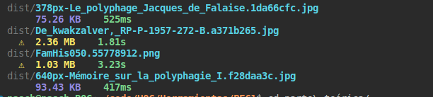

En este documento se describirán los pasos que se siguieron en la elaboración del proyecto. Se han descrito estos de forma concisa y objetiva, intentando respetar el orden cronológico en el que sucedieron las distintas tomas de decisión y posteriores ejecuciones de las mismas, aunque dando siempre prioridad al orden temático. 

La página final es accessible de forma pública a través del siguiente enlace:

[https://lively-fenglisu-dd4606.netlify.app/](https://lively-fenglisu-dd4606.netlify.app/)

El repositorio de GitHub es el siguiente:

[https://github.com/nacaru-w/PEC1-Herramientas](https://github.com/nacaru-w/PEC1-Herramientas)

El proyecto se realizó en un ordenador con un SO Linux Ubuntu 22.04.1 LTS. Para la redacción de la parte teórica se creó un documento en formato [markdown](https://www.markdownguide.org/) que sería posteriormente transformado en un documento PDF a través de LaTeX con la herramienta de conversión libre [Pandoc](https://pandoc.org/).

## Aspectos generales
Antes de comenzar el aspecto programático del diseño de la web, se consideró el tema en torno al cual sería construido el contenido. El enunciado de la PEC pedía «un pequeño portal biográfico». Para este fin, se eligió al personaje histórico [Tarrare](https://en.wikipedia.org/wiki/Tarrare).

Con el objetivo de conseguir cierta coherencia visual en cuanto a colores, se decidió utilizar la herramienta [Coolors](https://coolors.co/) para establecer una paleta de colores la cual se seguiría a lo largo del proyecto. Se decidió, igualmente, utilizar un estilo sobrio y minimalista, sin excesivo abarrotamiento de la página con el objetivo de evitar tiempos de carga excesivos; se tomaron algunas de las ideas mostradas en [brutalistwebsites.com](https://brutalistwebsites.com/) como inspiración.

El enunciado de la PEC solicitaba que el contenido fuera libre, por lo que se decidió en este punto la utilización de una licencia libre Creative Commons que solo incluyera restricciones a la reproducción de la página para el uso comercial y ante una modificación sustancial. Para este fin, se empleó la licencia [Creative Commons Attribution-NonCommercial-NoDerivs 2.0 Generic](https://creativecommons.org/licenses/by-nc-nd/2.0/) (CC BY-NC-ND 2.0).

Posteriormente, se creó un repositorio en git de forma local y [se subió](https://github.com/nacaru-w/PEC1-Herramientas) a GitHub. Esto permitiría tener un sistema de control de cambios y un _back-up_ almacenado en línea en caso de que se produjera algún problema con los archivos en el curso de la realización del proyecto. Este cambio fue reflejado en el archivo `json`:

```json
"repository": {
    "type": "git",
    "url": "https//github.com/nacaru-w/PEC1-Herramientas.git"
},
```

## Editor de código

Como gestor de código se decidió utilizar Visual Studio Code (VSCode). 

* __Justificación__: la razón por la que se eligió esta aplicación respecto a las otras es porque ya estaba familiarizado con su uso, porque posee una terminal integrada a través de la cual pueden ejecutarse comandos y porque ya había instalado algunas herramientas para optimizar código en el pasado que me ayudarían en el proceso: GitLens y multiples _build tasks_.

* __Resultados__: VSCode fue una herramienta muy útil para desarrollar el código. Todos los comandos de npm y pandoc, además de las diversas interacciones con git fueron ejecutados a través de la consola integrada. El programa incluye un servicio de diagnóstico local que te avisa de posibles problemas en el código, y a través de Gitlens se exploró el historial de ediciones en varias ocasiones para decidir o revertir múltiples cambios.

## Gestión de paquetes

A continuación se tomó la decisión de con qué gestor de paquetes trabajar el proyecto. Para este fin, aunque se consideró emplear yarn, se decidió finalmente utilizar el gestor de paquetes [npm](https://www.npmjs.com/). 

* __Justificación__: las principales razones por las que se eligió npm fueron: es más común entre los desarrolladores _frontend_, incluye herramientas útiles por defecto como NodeJS, y posee un [buscador](https://www.npmjs.com/package/) sencillo de utilizar a la hora de incorporar nuevas dependencias que puedan formar parte del proyecto. Además, npm ya se encontraba instalado en mi dispositivo y estaba familiarizado con algunos de sus comandos, por lo que solo hubo que realizar una comprobación para confirmar que se estaba usando una versión adecuada. 

Tras comprobar que se estaba utilizando la versión de `npm` adecuada, a través de la consola se ejecutó el comando `init` del mismo gestor de paquetes, creando un archivo `json` a partir del cual construir la página web.


* __Resultados__: npm es una herramienta sencilla de utilizar. Se encuentra ya instalado en muchos dispositivos y su catálogo de dependencias es útil a la hora de añadir nuevos elementos a la página. Instala por defecto diversos módulos de node necesarios e incluye una serie de dependencias por defecto que pueden ser de utilidad en proyectos similares.

## Utilización de un _module bundler_

A través de npm se decidió utilizar un module bundler a través del cual construir un _boilerplate_ sobre el cual trabajar en el proyecto. 

* __Justificación__: aunque ya había utilizado Webpack [en proyectos anteriores](https://github.com/nacaru-w/twinkle-lite), decidí utilizar Parcel para afianzar lo aprendido en el módulo M2 de la asignatura. Además, parcel imprime en la consola posibles problemas y otros detalles de diagnóstico (avisa de archivos incompatibles o demasiado pesados). 

Se instaló Parcel de forma local y se prodecedió a ejecutar el comando `npx parcel src/index.html` para construir un servidor local que permitiría ver los cambios realizados a nuestra paǵina web en tiempo real. A continuación, se creó una hoja de estilo CSS y un archivo `.js` como dependencia al archivo `index.html` principal.

Se instaló Rimraf y npm-run-all a través de npm para tener una herramienta que limpiase la caché creada por parcel en el procesamiento de los archivos y la construcción del servidor local. Se incluyeron ambas dependencias en el archivo `json` en las siguientes líneas de código para que se dé su instalación ante la ejecución del comando `npm run build`:

```json
  "devDependencies": {
    "parcel": "latest",
    "rimraf": "latest",
    "npm-run-all": "latest"
  },
```

Asimismo se crearon diversos scripts que facilitarían el trabajo en el proyecto y se añadieron al archivo `json` (véase imagen 1):

* `npm run clean` limpia la caché creada por Parcel a través de Rifraf (`rimraf dist .parcel-cache`)

* `npm run build` se asoció a `npm-run-all clean parcel:build` permite a parcel construir la aplicación para producción y optimizar los archivos del proyecto. También ejecuta `clean` que limpia la caché a través de Rifraf.

* `npm run start` se asoció a `npm-run-all clean parcel:dev`, esto permitiría igualmente limpiar la caché cada vez que se ejecutase el servidor local.

En general, los resultados de utilizar Parcel fueron los siguientes:

* __Resultados__: Parcel optimizó en una sola línea de código lo hallado en los archivos `.html`, `.css` y `.js`. Además, construyó un servidor local a través del cual se visualizaría el trabajo en tiempo real. En la consola, además, mostraba información útil como posibles incompatibilidades o el añadido de archivos con demasiado peso al proyecto.



## Implementación de dependencia externa

Como requisito en la PAC, debía de realizarse la implementación de algún recurso externo en forma de dependencia. 

* Justificación: para este fin, se buscaron varias opciones a través del catálogo de npm. Se descartaron algunas de ellas por estar posiblemente obsoletas y se decidió utilizar [sidebarjs](https://www.npmjs.com/package/sidebarjs). Se empleó esta dependencia por ser ligera, porque permitía añadir un menú de navegación lateral adicinal, por estar adaptada a diferentes navegadores y a dispositivos móviles y tablets; y porque es gestionable a partir del archivo `app.js`, por lo que nos permitiría paralelamente realizar la implementación por javascript que también pedía el enunciado de la PEC.

Se instaló mediante la consola a través del código `npm install sidebarjs`. Se escribió el código HTML necesario (la dependencia requiere de la utilización de ciertos atributos), se realizó el _import_ del código en el archivo `app.js` a través de las líneas:

```js
import { SidebarElement, SidebarService } from 'sidebarjs';
import 'sidebarjs/lib/sidebarjs.css';
```

Y se creó una variable que generara la _sidebar_:

```js
const sidebarjs = new SidebarElement({
});
```

La dependencia generó un fichero `sidebarjs` en la carpeta `node_modules` con el código necesario para su implementación. Además, generó código en el archivo `json` que permitía su instalación en la compilación para producción:

```json
  "dependencies": {
    "sidebarjs": "^9.0.0"
  }
```

Tras comprobar que la dependencia funcionaba correctamente y que no generaba lentitud o problemas de compatibilidad, se decidió mantener su uso en la página web.

## Código HTML
Se decidió finalmente repartir la página web a lo largo de ocho páginas `html` distintas. Estas fueron almacenadas en un fichero `src` de acuerdo al _boilerplate_ propuesto. Estas incluían:

* Una página principal, llamada `index.html` que solo muestra una gran imagen y enlaces al resto de contenido de la web.
* Una página de presentación del contenido, llamada `presentation.html`, en la que se muestran descripciones de las diferentes secciones entre las que se distribuye la web.
* Una página, `category.html` a través de la cual se puede acceder a la información biográfica de Tarrare, dividida en diferentes secciones:
  * `detail1.html`, en la que se habla de la vida temprana del biografiado.
  * `detail2.html`, en la que se describe su apariencia y sus hábitos comportamentales.
  * `detail3.html`. en la que se relatan los diferentes intentos de curar su patología.
  * `detail4.html`, en la que se habla de su muerte y los últimos momentos de su vida.
* Una página de enlaces, titulada `links.html`, en la que se hallan enlaces a las fuentes de información/imágenes y un pequeño aviso legal en el que se describe la licencia con la que se ha liberado el contenido de la web.

En cuanto al etiquetado HTML, este se realizó de forma jerárquica:

* Se incluyó una sección `head` en la que se contenía información sobre metadatos de la página, así como las llamadas a la hoja de estilos CSS y el documento que contiene los scripts JS:

```html

<head>
    <meta charset="utf-8" />
    <title>Tarrare: main</title>
    <link href="css/styles.css" rel="stylesheet">
    <script type="module" src="js/app.js"></script>
</head>

```

* Se incluyó una sección `body`, en la que incluir el resto de información no contenida en `head`. Aquí se procedió a incluir el contenido de la página _per se_, dividido en diferentes secciones:[^1]
  * Una imagen (`img`) correspondiente al icono del menú situado en la parte superior izquierda de la página junto a una sección `div`, identificada con los atributos `sidebarjs` (necesario para la interacción con la dependencia mencionada en la sección anterior de este documento) y `class="sidebar"`, localizada previamente al resto del código principal de la página, en la que se desarrolla la barra de navegación desplegable lateral y los diferentes elementos (etiquetados con `a` al tratarse de enlaces) que la contienen. Esta contiene una lista no ordenada (`ul`) anidada que contiene otra lista no ordenada en su interior.
  * Una sección `header`, que contiene:
    * Los título y subtítulo principales de la página, identificados con las etiquetas `h1` y `h2`.
    * Una sección de navegación, más general respecto a la hallada en la barra desplegable lateral, marcada con la etiqueta `nav`, que a su vez contiene una lista no ordenada (`ul`) con las diferentes opciones de navegación, etiquetadas como `a` al tratarse de enlaces.
  * Una sección `main`, en la que se desarrolla el contenido central del cuerpo del proyecto, que varía ampliamente entre cada página html del proyecto. Esta puede poseer elementos visuales, contenidos en secciones `figure`, representados en forma de imágenes (etiquetados como `img`), vídeos incrustados (etiquetados como `iframe`), con un párrafo que hace de pie de imagen etiquetado con `figcaption`; listas no ordenadas (`ul`), elementos `div`, párrafos `p`, etc.
    * Se emplearon las etiquetas `cite` para designar obras de creación, así como etiquetas `em` en casos en los que se consideró que debía darse énfasis.
  * Una sección `footer`, en la que se desarrolla la sección inferior de la web. Esta contiene información sobre el autor del proyecto, así como una breve mención a la licencia. Ambas piezas de información fueron etiquetadas con `div` y atribuidas las clases `author` y `copyright`, respectivamente.

El código fue sometido al [servicio de validación](https://validator.w3.org) del World Wide Web Consortium (W3C) para corregir errores graves y optimizar la accesibilidad del mismo.

* __Justificación__: la estructura dotada a la página viene definida por las exigencias descritas en el enunciado de la PEC. Se decidió dividir las subpáginas «detalle» en diferentes secciones para facilitar la navegación y no abarrotar con texto una sola página.

* __Resultado__: la página se desarrolló de la forma deseada, el etiquetado correcto permitió posteriormente poder atribuir declaraciones CSS en la hoja de estilos y aplicar los scripts en `app.js` de forma efectiva. 

## Código CSS

El código CSS del proyecto fue almacenado en un fichero `css`, subcarpeta del fichero `src` (la ruta, respecto a la raíz, es `src/css/styles.css`). El código incluye:

* Una serie de `@media` queries_ con el objetivo de dotar a la página de la _responsiveness_ solicitada en el enunciado de la PEC. Estas se realizan en torno a las diferentes dimensiones del dipositivo, a través del uso de las propiedades `min-height` y `min-width`.
* Un cuerpo de reglas CSS realizadas en función del etiquetado HTML realizado previamente.

Los cambios diferentes cambios se visualizaron en tiempo real gracias al servidor proporcionado a través de Parcel, y se utilizó de forma significativa las opciones de desarrolladores del navegador firefox:

* Se empleó el inspector DOM para observar y acceder a partes del código específicas, así como para cambiar los diferentes valores de las reglas CSS y visualizar las modificaciones para más tarde aplicarlas.
* Se empleó el «_responsive design mode_» dentro de estas opciones para comprobar la estructura y formato de la página desde diferentes dispositivos y dimensiones de pantalla.
* Se hizo uso de la opción «fuentes» para observar el resultado de la aplicación de distintas fuentes para más tarde elegir las adecuadas para el proyecto.
* Se empleó la opción «animaciones» para los casos en los que se utilizaron las propiedades `transition` para distintos elementos de la página, como los enlaces.
* Se consultó la consola para comprobar posibles errores.

Adicionalmente, se hizo uso significativo del recurso [caniuse.com](https://caniuse.com/) con el objetivo de comprobar la compatibilidad de las diferentes propiedades utilizadas en el proyecto. Se comprobó qué las características implementadas poseían una compatibilidad superior al 96% de los dispositivos utilizados por usuarios a nivel global en todos los casos.

De forma paralela al código HTML, el archivo fue sometido al [servicio de validación](https://jigsaw.w3.org/css-validator/) del World Wide Web Consortium (W3C), el cual certificó que no existían errores.

* __Justificación__: las `@media` _queries_ permiten adaptar las diferentes reglas CSS a contextos específicos con el objetivo de priorizar la accesibilidad a través de diferentes dispositivos. El recurso caniuse.com permite complementar la labor de adaptación a navegadores realizada a través de la compilación por Parcel para asegurar una correcta visualización.

* __Resultados__: tras comprobar a través de las diferentes modificaciones mediante la opción «responsive design mode», se pudo corroborar que la página permanecía visualizable a través de distintos dispositivos que muestran dimensiones muy diversas.

## Postprocesador CSS

Parte de los requisitos era la instalación de un post-procesador CSS/JS. Para esta finalidad se decidió utilizar PostCSS y Autoprefixer.

* __Justificación__: se utilizaron estos dos al estar incluidos en el compilador de Parcel. Se sopesaron otras opciones como [Sass](https://sass-lang.com/) o [LESS](https://lesscss.org/), pero al no conocer las curvas de aprendizaje de estos preprocesadores, se decidió utilizar los que ya estaban incluidos en la compilación de Parcel.

Se configuró el archivo `json` del `root` para que el código se adaptase a navegadores a través de la siguiente línea:

```json
"browserslist": "> 0.5%, last 2 versions, not dead",
```

* __Resultados__: como parte de la acción de estas aplicaciones, se optimizó el código CSS, de forma que algunas secciones de código quedaron modificadas para mayor facilidad de procesamiento. Uno de los ejemplos es el siguiente:

Este segmento del código:

```CSS
main p {
    font-size: 1.15em;
}

main ul {
    font-size: 1.15em;
}
```

Pasó a visualizarse de la siguiente forma:

```CSS
main p, main ul {
  font-size: 1.15em;
}
```

## Publicación de la página

La descripción del enunciado de la PEC pedía, igualmente, la publicación de la página en internet. Para este fin se utilizó el servicio gratuito de hosting Netlify.

* __Justificación__: aunque GitHub ofrece un servicio de hosting gratuito, este ya estaba siendo utilizado para mi página web personal. Se consideró Netlify como segunda opción tras observar que incluía un servicio de actualización rápida a partir de un repositorio de github.

* __Resultado__: Netlify realizaba actualizaciones automáticas de la página al ejecutar el comando `git push` desde la consola de VSCode, lo cual facilitaba la tarea de llevar la versión de producción al espacio _online_.

[^1]: Las secciones `header`, `main`, `footer`, así como el icono de opciones y la `div` con la clase `sidebar` correspondiente a la barra de navegación lateral son comunes a todas las páginas que conforman la web. 